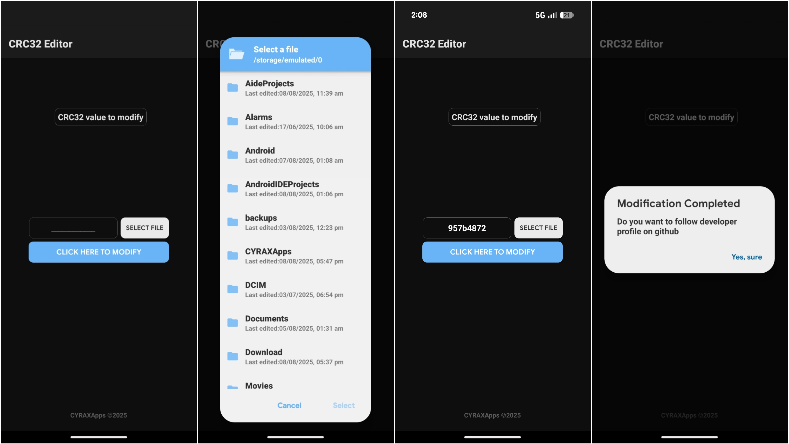

## CRC32 Editor 2.0

### Preview ⟩

### What's New ⟩

Dynamic Theme

Android 7 to 16 Supported.

CRC32 calculation speed for faster results.

Added support for more file types and data formats.

Enhanced user interface for a cleaner and easier experience.

Minor bug fixes and performance optimizations.

Better accuracy for CRC32 checksum generation and verification.

### Description ⟩

CRC32 Editor is a tool that allows users to view, modify, and validate the CRC32 checksum of files or data streams. CRC32, or Cyclic Redundancy Check, is a hashing algorithm that generates a 32-bit checksum to detect errors in transmitted or stored data. 

### Official handle 👇🏻
GitHub: https://github.com/CYRAXApp
Telegram: https://t.me/CYRAXApps
